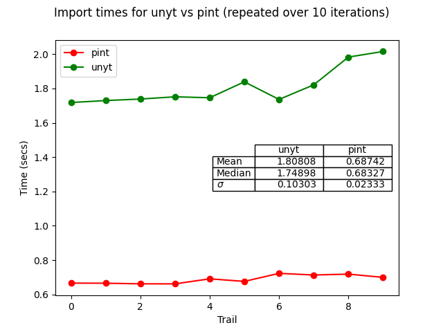

# Units Benchmarks
This repository contains baseline benchmarks for comparing different unit packages in python. Specifically, current packages of interest are:

1. [unyt](https://github.com/yt-project/unyt)
2. [pint](https://github.com/hgrecco/pint)


## The Plan
The plan(subject to change) is to explore the packages' api and compare the following aspects of the packages:

1. Package import times
2. Serialization and hashing support and performance
3. Support for various unit systems and quantities
4. Other minor package features etc...

## Usage
Python version > 3 is required. Install requirements from `requirements.txt`.

```sh
$ pip install -r requirements.txt
$ python benchmark.py --help

usage: benchmark.py [-h] {plot} ...

Perform benchmark tests for different unyt packages

positional arguments:
  {plot}      Sub Commands
    plot      Plot import times for pint vs unyt

optional arguments:
  -h, --help  show this help message and exit
```

## Import Times for Pint vs. Unyt
Figure below shows import times for `unyt` vs `pint`. It is quicker to import `pint` than `unyt`.



The system information is listed below:
```
cpu:                                                            
                       Intel(R) Core(TM) i7-7700HQ CPU @ 2.80GHz, 2269 MHz
                       Intel(R) Core(TM) i7-7700HQ CPU @ 2.80GHz, 2853 MHz
                       Intel(R) Core(TM) i7-7700HQ CPU @ 2.80GHz, 2704 MHz
                       Intel(R) Core(TM) i7-7700HQ CPU @ 2.80GHz, 2471 MHz
                       Intel(R) Core(TM) i7-7700HQ CPU @ 2.80GHz, 1925 MHz
                       Intel(R) Core(TM) i7-7700HQ CPU @ 2.80GHz, 2210 MHz
                       Intel(R) Core(TM) i7-7700HQ CPU @ 2.80GHz, 2307 MHz
                       Intel(R) Core(TM) i7-7700HQ CPU @ 2.80GHz, 2507 MHz
memory:
                       Maximum Capacity: 32 GB
                       Maximum Voltage: 1.2 V
                       Maximum Voltage: 1.2 V

platform:
                       Linux isisdell 5.0.0-32-generic #34~18.04.2-Ubuntu SMP Thu Oct 10 10:36:02 UTC 2019 x86_64 x86_64 x86_64 GNU/Linux
```